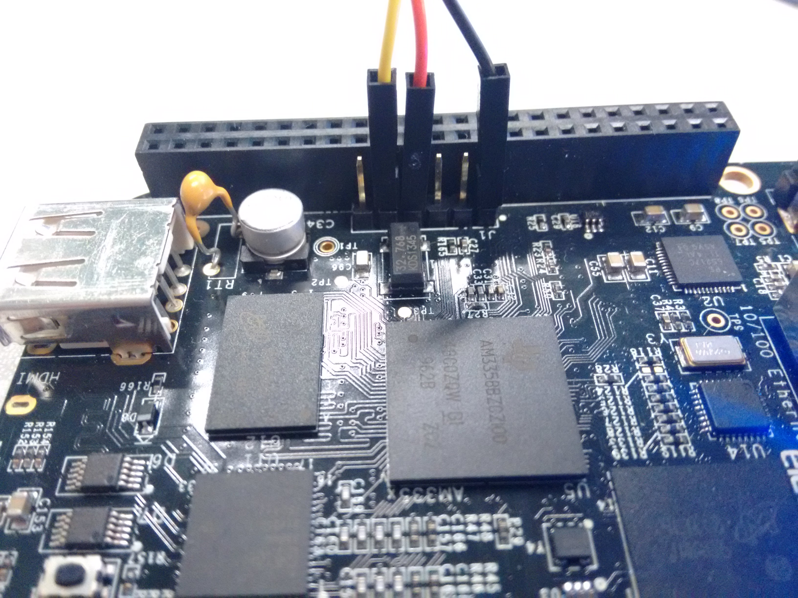

Diese Anleitung erstellt ein bootfähiges Image in einer VM für den Beaglebone Black und zeigt wie man die Netzwerkschnittstelle desselben aktiviert. Sie ist angelehnt an den [Developer Guide von Minix.org](http://wiki.minix3.org/doku.php?id=developersguide:minixonarm).

## Installation einer virtuelle Maschine
Laden Sie sich zuerst [VirtualBox 5.1](https://www.virtualbox.org/wiki/Downloads), das [Extension Pack](http://download.virtualbox.org/virtualbox/5.1.6/Oracle_VM_VirtualBox_Extension_Pack-5.1.6-110634.vbox-extpack), sowie [Ubuntu 16.04 Server](http://de.releases.ubuntu.com/16.04/ubuntu-16.04-server-i386.iso) herunter. Installieren Sie VirtualBox inklusive dem Extension Pack, erstellen Sie eine virtuelle Maschine und installieren darin das zuvor heruntergeladene Ubuntu Image. Eine bebilderte Anleitung finden Sie z.B. unter [askubuntu.com](http://askubuntu.com/questions/142549/how-to-install-ubuntu-on-virtualbox). **Tipp 1:** Installieren Sie bei der Installation den SSH Server in ihrer VM, um später komfortabel (Copy&Paste, Fenstergröße) mit einem SSH Client auf ihre VM zuzugreifen. Hierfür sollten Sie zudem unter den Einstellungen ihrer VM (Network > Adapter 1) eine Portweiterleitung einrichten (127.0.0.1:2244 -> 10.0.2.15:22). **Tipp 2:** Machen Sie sich mit dem Texteditor Vim vertraut. **Tipp 3:** Nutzen Sie die [Tab Completion](http://www.howtogeek.com/195207/use-tab-completion-to-type-commands-faster-on-any-operating-system/). **Tipp 4:** Lernen Sie was``Ctrl+R`` bewirkt.

## Laden & Kompilieren des Kernels

Zuerst downloaden Sie die Source File der letzten stabilen Release (v3.3.0), da die aktuelle Entwicklerversion nicht korrekt startet ([#104](https://github.com/Stichting-MINIX-Research-Foundation/minix/issues/104)).

```
cd ~
git clone git://git.minix3.org/minix
cd minix
git checkout -b dev v3.3.0
```

Erstellen Sie eine ".settings" Datei durch z.B. ``vim .settings`` mit folgendem Inhalt:

```
#beaglebone (and black)
U_BOOT_BIN_DIR=build/am335x_evm/
CONSOLE=tty00
```

Bevor wir Minix kompilieren können müssen noch verschiedene Abhängigkeiten installiert werden:

```
sudo apt-get update
sudo apt-get install build-essential mtools zlibc zlib1g zlib1g-dev curl gcc-4.9
```

Nun starten wir das build script und holen uns 2-3 Tassen Kaffee. **Achtung: ** Während der Installation lädt das Installationsprogramm Dateien aus dem Internet nach.

```
HOST_CC="gcc-4.9" ./releasetools/arm_sdimage.sh
```

Nach Beendigung des Scripts sollte sich eine Datei namens "minix_arm_sd.img" unter "~/minix/" finden. Deren Inhalt (nicht die Datei an sich) muss nun auf die Mini SD Karte kopiert werden. Hierzu bietet sich Win32Diskimager für Windows an, oder da Sie sich schon in einer Ubuntu VM befinden dd an. Um mit dd den Inhalt auf die SD Karte zu kopieren muss diese erst einmal an das Gastsystem weitergereicht werden. Hierzu installieren Sie zuerst die Gasterweiterungen:

```
sudo apt-get install virtualbox-guest-utils
```

Und fahren die virtuelle Maschine herunter. In den Einstellungen zu der VM aktivieren Sie bitte den USB Controller (wenn Sie USB 2.0/3.0 nutzen wollen, müssen Sie zuerst das [Extension Pack](https://www.virtualbox.org/wiki/Downloads) installieren). Tipp: Linux Nutzer sollten im Host System ihren Benutzer zur Gruppe "vboxusers" hinzufügen.

Starten Sie nun die VM, verbinden Sie den Kartenleser mit Ihrem PC und stecken die SD Karte ein. In der Menü Bar ihrer VM sollten Sie nun unter "Devices" > "USB" das Kartenlesegerät auswählen können. Mit dem folgenden Kommando können Sie überprüfen, ob die SD Karte erkannt wurde:

```
sudo fdisk -l
```

``Disk /dev/sda`` sollte die VM Platte sein und ``Disk /dev/sdb`` die SD Karte. Sollte es nicht funktionieren, versuchen Sie das Kartenlesegerät vom PC zu trennen und nach kurzer Zeit wieder einzustecken.

Nun kann mit dd die Speicherkarte überschreiben werden. **Wichtig:** Bitte kontrollieren Sie genau auf welchen Gerät geschrieben wird, um nicht wichtige Daten zu verlieren.

```
sudo dd if=minix_arm_sd.img of=/dev/sdb bs=1M oflag=direct status=progress
```

## Booten von der SD Karte

Der Beaglebone Black bootet standardmäßig stets von der internen MMC. Damit der Start von einer
SD-Karte geschieht stecken Sie die SD-Karte in den vorgesehenen Slot, schließen Sie die
mitgelieferte USB Stromversorgung an. Drücken Sie anschließend Reset (S1) und den Userboot Button (S2) gleichzeitig. S1 muss nur kurz gedrückt werden, S2 sollten Sie ein paar Sekunden gedrückt halten.

Den Unterschied zwischen einem korrekten Bootvorgang von der SD-Karte ist sofort ersichtlich. Während die LEDs beim Booten von der MMC einen Status anzeigen (Zugriffe auf die Karte, CPU Auslastung, ...) leuchten beim SD-Boot alle LEDs durchgängig.

## Zugriff auf das System

Die Minix ARM-Portierung für den Beaglebone Black hat keinen Framebuffersupport. Zu Versuchen
einen Monitor über die Mini-HDMI Schnittstelle anzusteuern ist somit von Beginn an zum Scheitern
verurteilt. Auch eine Netzwerkunterstützung ist nicht ohne Nutzereinstellungen vorhanden,
weswegen ein SSH- oder Telnetverbindungsversuch ebenfalls wenig erfolgversprechend ist.
Für einen ersten Zugriff benötigen wir den seriellen Debug-Output des Beaglebone über das zur
Verfügung gestellte FTDI-Kabel. Mit diesem (und den notwendigen Treibern) kann am PC ein
virtueller COM Port erzeugt und über diesen das Beaglebone angesteuert werden.

### Anschluss am Beaglebone

Auf dem Beaglebone befinden sich 6 zusammengehörige Pins. Hiervon werden nur Pin 1 (Erdung), 4 (Senden) und 5 (Empfangen) benötigt. Verbinden Sie das schwarze Kabel mit Pin 1, das orange/rote mit Pin 4 und das gelbe mit Pin 5. **Achtung:** Dies gilt nur für das mitgelieferte Kabel. Andere Kabel könnten mit dieser Konfiguration das Board zerstören.



### Anschluss/Verbinden am PC

#### Windows

Windows Nutzer müssen zuerst die entsprechenden Treiber für den [Virtual COM Port](http://www.ftdichip.com/Drivers/VCP.htm) herunterladen und installieren. Nun haben Sie die Möglichkeit diesen seriellen Port an ihre VM weiterzureichen (via VM Einstellungen) und dann wie im nächsten Abschnitt gezeigt zu verbinden, oder Sie nutzen [Putty](http://www.chiark.greenend.org.uk/~sgtatham/putty/) um sich direkt mit ihrem Beaglebone zu verbinden (baud=115200, data bits=8, stop bits=1).

### Linux

Linux Nutzer sollten den Treiber schon besitzen und nur mit ``dmesg`` den Gerätenamen ermitteln (z.B. ttyUSB0). Mittels Screen kann man sich nun direkt verbinden:

```
sudo screen /dev/ttyUSB0 115200
```

Sollte Screen noch nicht installiert sein, kann dies mit folgendem Kommando nachgeholt werden:

```
sudo apt-get install screen
```

### Starten des Systems

Nachdem entweder Putty oder Screen gestartet wurde, schließen Sie bitte den Beaglebone an die Stromversorgung an. Sollte Minix korrekt gestartet sein, erwartet Sie eine Anmeldemaske bei welcher Sie sich als "root" anmelden können.

### Ethernet Konfiguration

Wie die Ethernet Schnittstelle aktiviert wird, erfahren Sie unter [minix.org](http://wiki.minix3.org/doku.php?id=developersguide:minixonarm#ethernet_configuration).

### Weitere Informationen

[Testing Minix ARM](http://wiki.minix3.org/doku.php?id=developersguide:testingminixarm) beschreibt Möglichkeiten die verschiedenen mitgelieferten Treiber zu testen.

