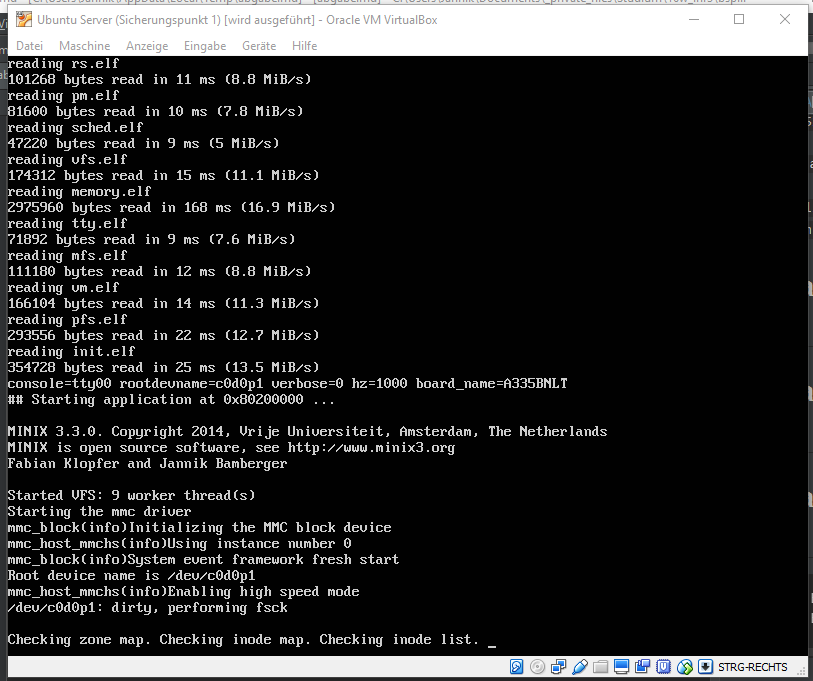
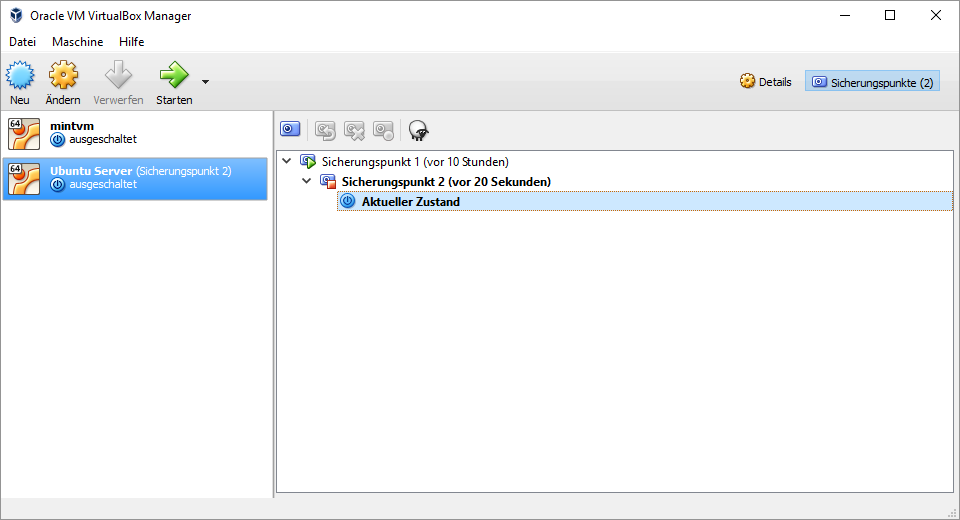

# Lösungen zum 1. Übungsblatt
# Klopfer, Fabian und Bamberger, Jannik

## Aufgabe 1 (35/35 Punkte)

Namen im Startscreen:


- ``cd`` Arbeitsverzeichnis zu übergebenem Verzeichnis wechseln; ``~`` ist das home-Verzeichnis
- ``git clone git://git.minix3.org/minix`` Klont das Repository von der URL in das aktuelle Verzeichnis
- ``git checkout -b dev v3.3.0`` checkt aus den Branch `dev` den Commit mit dem Name `v3.3.0` aus. **[KH] Erstellt eigentlich einen neuen Branch dev**

- ``.settings`` Build Einstellungen für den Beaglebone Rechner
  ```
  #beaglebone (and black)
  U_BOOT_BIN_DIR=build/am335x_evm/
  CONSOLE=tty00
  ```

- ``sudo`` Kommando mit root Rechten ausführen

- ``sudo apt-get update`` Paketindex des Paketmanagers updaten

- ``sudo apt-get install build-essential mtools zlibc zlib1g zlib1g-dev curl gcc-4.9`` Installieren der angegebenen Packages

- ``HOST_CC="gcc-4.9" ./releasetools/arm_sdimage.sh`` Setzt die Variable `HOST_CC` auf `gcc-4.9` und führt dann das angegebene Skript aus.

- ``sudo fdisk -l`` Liste die Partitionstabellen der unter `/proc/partitions` genannten Geräte auf.

- ``sudo dd if=minix_arm_sd.img of=/dev/sdb bs=1M oflag=direct status=progress`` Dateien konvertieren und kopieren.
    - `if` Eingabedatei
    - `of` Ausgabedatei
    - `bs=1M` maximal 1Mb auf einmal lesen
    - `oflag=direct` Direkte Ein/Ausgabe benutzen, d.h. Kernel-IO soweit möglich umgehen
    - `status=progress` Fortschritt und Übertragungsgeschwindigkeit anzeigen

- ``sudo screen /dev/ttyUSB0 115200`` startet `screen` für das Gerät unter ``/dev/ttyUSB0`` mit einer Baud-Rate von `115200`. Dadurch wird ein Fenster mit der entsprechenden Konsole angezeigt.

## Aufgabe 2 (2/2 Punkte)

Snapshot:



## Aufgabe 3 (5/5 Punkte)

1. Mit der Taste `q`

2. Mit `\ ` und `?` kann vorwärts/rückwärts gesucht werden und mit `n` und `N` kann zwischen den einzelnen Ergebnissen gesprungen werden.

3. Aus `NAME, SYNOPSIS, CONFIGURATION, DESCRIPTION, OPTIONS, EXIT STATUS, RETURN VALUE, ERRORS, ENVIRONMENT, FILES, VERSIONS, CONFORMING TO, NOTES, BUGS, EXAMPLE, AUTHORS, und SEE ALSO`

4. Eine kurze Zusammenfassung des Kommando-/Funktionsinterfaces.

5. Mit `man -K keyword` wird überall nach "keyword" gesucht. **[KH] Überall? :stuck_out_tongue_winking_eye:**


## Aufgabe 4 (7/7 Punkte)
Klonen und Upstream Remote hinzufügen:
```
git clone git@git.uni-konstanz.de:jannik-bamberger/bspk2016.git
cd bspk2016/
git remote add upstream git@git.uni-konstanz.de:info3/bspk2016.git
```
Updaten mit Upstream Daten:
```
git fetch upstream
git checkout master
git rebase upstream/master
```

## Aufgabe 5 (7/6 Punkte)
- `cat`: Dateien konkatenieren und auf Standardausgabe schreiben
- `pwd`: Aktuelles Arbeitsverzeichnis ausgeben
- `ls`: Inhalt des aktuellen Areitsverzeichnisses ausgeben
- `cd`: Arbeitsverzeichnis wechseln
- `mv`: Dateien verscheiben oder umbenennen
- `rm`: Dateien oder Ordnerstrukturen löschen
- `mkdir`: Ordner erstellen
- `cal`: Einen Kalender ausgeben
- `date`: Systemdatum anzeigen oder ändern
- `time`: Programme ausführen und deren Ressourcenkonsum ausgeben
- `watch`: Programme periodisch ausführen und deren Ausgabe anzeigen
- `find`: In Verzeichnisstrukturen nach Dateien suchen

`pwd` und `cd` sind Built-Ins, da sie den Kontext der Shell, also das aktuelle Verzeichnis benötigen, und den Status der Shell verändern. Bei den externen Programmen ist dies nicht der Fall.

## Aufgabe 6 (5/5 + 10% Punkte)
Siehe `hello.c`
